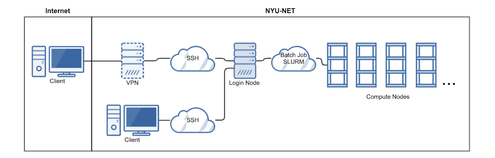

# Greene HPC

## Overview


```{image} assets/greene.jpg
:alt: NYU Greene
:width: 90%
:align: center
```


<br>

The Greene cluster is named after Greene Street in SoHo, a neighborhood in Lower Manhattan near NYU. The cluster has also "green" characteristics, such as most of the cluster nodes are water cooled and it is deployed in a power efficient data center. NYU High Performance Computing (NYU HPC) provides access to state of the art supercomputer hardware and cloud services to eligible faculty and students across all of NYU.

**Ranked #271** on the June 2020 edition of the Top 500 list (based on an extrapolated performance of 1.731 PF).

The cluster is accessed through login nodes which are nodes or servers dedicated to provide HPC users access to compute nodes. Compute nodes are more powerful and optimized to run computations as per the jobs submitted by HPC users.


## Software

NYU Greene runs on **Linux** (RedHat Enterprise Linux 8.4) and it is advised to learn more about Linux if you are not familiar with it.

```{admonition} Linux Useful Links
:class: hint

- [https://www.geeksforgeeks.org/essential-linuxunix-commands](https://www.geeksforgeeks.org/essential-linuxunix-commands)
- [https://www.tutorialspoint.com/unix/index.htm](https://www.tutorialspoint.com/unix/index.htm)
- [http://software-carpentry.org/lessons/](http://software-carpentry.org/lessons/)
- [https://www.edx.org/course/introduction-linux-linuxfoundationx-lfs101x-0](https://www.edx.org/course/introduction-linux-linuxfoundationx-lfs101x-0)
```

NYU HPC uses **SLURM** for cluster workload management. Slurm is an open source, fault-tolerant, and highly scalable cluster management and job scheduling system for large and small Linux clusters. Slurm requires no kernel modifications for its operation and is relatively self-contained.


## Hardware
- The Total number of available nodes is 672
    1. 6 login nodes
    1. 670 compute nodes
        - 524 Standard memory (180 GB)
        - 40 Medium memory (360 GB)
        - 4 Large memory (3,014 GB)
        - 73 RTX8000 GPU nodes
        - 20 V100 GPU nodes
        - 9 A100 GPU nodes
    1. 6 administrative nodes

- Total number of CPU cores is 31,584
- Total number of GPU cards is 368 
    1. 292 RTX8000 (48 GB)
    1. 76 V100 (32 GB)
- Total primary memory is 163 TB
- Total secondary memory is 9.5 PB

```{tip}
You can check current {ref}`storage-status` and {ref}`resource-status` through respective dashboards.
```

## Network

- **Infiniband Network** : for MPI and file system access.
- **Management Network** : Ethernet 25Gbit  used by admins for node provisioning.
- **Out-of-band Network** : Ethernet 1Gbit used by admins.
- **External Network** : All cluster 'edge' nodes, such as login nodes, admin nodes, and Data Transfer Nodes, are connected to the NYU High-Speed Research Network (HSRN).


## Architecture

<!--  -->

```{image} assets/access.png
:alt: Architecture
:width: 90%
:align: center
```
<br>
<center><i>Generic diagram of the cluster architecture and outside connectivity</i></center>
<br>

## Workflow

**One Time Setup**
1. Log on to HPC login nodes via SSH.
1. Setup Anaconda environment.
1. Setup Visual Studio Code for easy project development. (Optional)
1. Setup Jupyter Notebook (Optional)

**General Workflow**
1. Log on to HPC login nodes via SSH.
1. Submit jobs on login nodes.
1. Your jobs will queue for execution on compute nodes.
1. Once done, examine the output.


```{admonition} Warning
:class: error

Please refrain from running any compute intensive jobs on the login nodes. This can lead to your account getting suspended.
```

**Interactive Worklow**
1. Log on to HPC login nodes via SSH.
1. Request Interactive shell session with required resources.
1. Run jobs interactively on compute nodes.
1. Once done, release resources.


```{tip}
Avoid interactive sessions when possible, interactive sessions are generally less efficient and less environment friendly. It is advised to use batch jobs instead which are automatically managed with energy saving in mind.
```

**Jupyter Lab Workflow**
1. Log on to HPC web interface.
1. Request interactive Jupyter Notebook / Lab session.
1. Run notebooks.
1. Once done, shutdown kernels and exit.